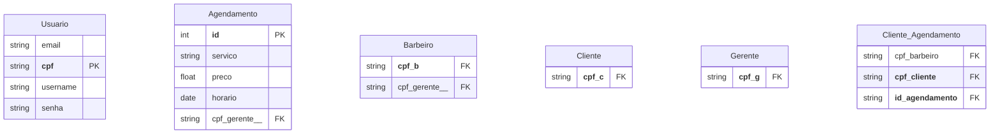

# Modelagem do Banco de Dados

## Modelo Entidade-Relacionamento(MER)

[imagem do modelo entidade relacionamento](https://github.com/CarlosG18/sys_barbershop/blob/modelagem_bd/topicos/modelagem_bd/imagens/modelagem_bd.md)

### cardinalidade
- Cliente (N) --> PARTICIPA --> (N) Agendamento
- Barbeiro (1) --> PARTICIPA --> (N) Agendamento
- Gerente (1) -->  GERÊNCIA --> (N) Barbeiro
- Gerente (1) -->  GERÊNCIA --> (N) Agendamento

## Modelo Relacional

### referências das chaves estrangeiras (FK):
- cpf_b(Barbeiro) referência cpf(Usuário);
- cpf_c(Cliente) referência cpf(Usuário);
- cpf_g(Gerente) referência cpf(Usuário);
- cpf_barbeiro(Cliente_Agendamento) referência cpf_b(Barbeiro);
- cpf_cliente(Cliente_Agendamento) referência cpf_c(Cliente);
- id_agendamento(Cliente_Agendamento) referência id(Agendamento);
- cpf_gerente(Agendamento) referência cpf_g(Gerente);
- cpf_gerente(Barbeiro) referência cpf_g(Gerente);
