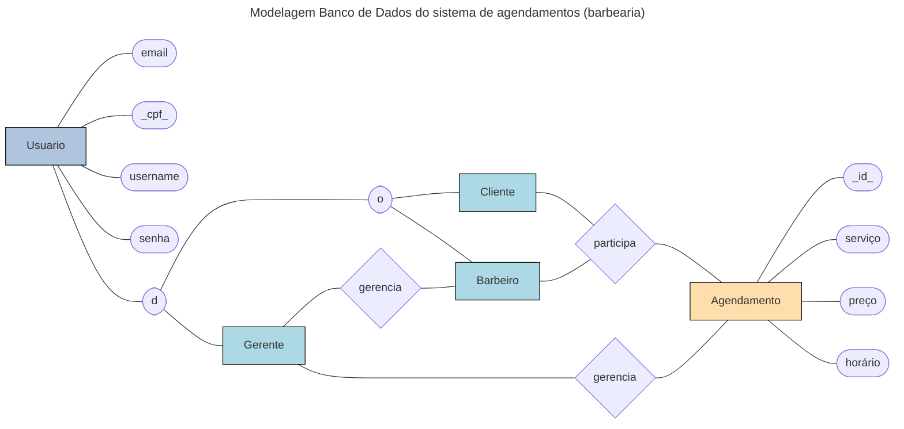
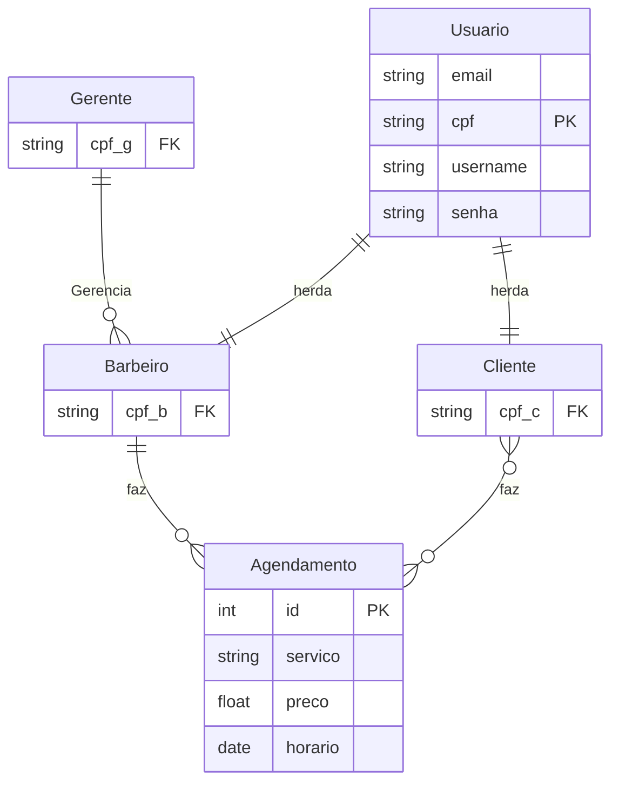

# Modelagem do Banco de Dados

## modelo relacional

```mermaid
---
title: Modelagem Banco de Dados do sistema de agendamentos (barbearia)
---
flowchart LR
    Usuario
    email([email])
    cpf([_cpf_])
    username([username])
    senha([senha])
    overlap([o])

    Usuario --- email
    Usuario --- cpf
    Usuario --- username
    Usuario --- senha

    Barbeiro
    Cliente
    Gerente
    
    Agendamento
    id([_id_])
    servico([serviço])
    preco([preço])
    horario([horário])

    Agendamento ---id
    Agendamento --- servico
    Agendamento --- preco
    Agendamento --- horario

    style Usuario fill:#B0C4DE,stroke:#000,stroke-width:1px
    style Gerente fill:#ADD8E6,stroke:#000,stroke-width:1px
    style Barbeiro fill:#ADD8E6,stroke:#000,stroke-width:1px
    style Cliente fill:#ADD8E6,stroke:#000,stroke-width:1px
    style Gerente fill:#ADD8E6,stroke:#000,stroke-width:1px
    style Agendamento fill:#FFDEAD,stroke:#000,stroke-width:1px
    
    especializacao([d])
    Usuario --- especializacao
    especializacao --- Gerente

    especializacao --- overlap
    overlap --- Barbeiro
    overlap --- Cliente
    
    relacionamento1{participa}
    relacionamento2{gerencia}
    relacionamento3{gerencia}

    Cliente --- relacionamento1
    relacionamento1 --- Agendamento

    Barbeiro --- relacionamento1

    Gerente --- relacionamento2 
    relacionamento2 --- Barbeiro

    Gerente --- relacionamento3
    relacionamento3 --- Agendamento

```
## modelo ER

```mermaid
erDiagram
    
    Usuario {
        string email
        string cpf PK
        string username
        string senha
    }
    
    Agendamento {
        int id PK
        string servico
        float preco
        date horario
    }

    Barbeiro {
        string cpf_b FK
    }
    Barbeiro ||--o{ Agendamento : faz

    Cliente {
        string cpf_c FK
    }

    Cliente }o--o{ Agendamento : faz

    Gerente {
        string cpf_g FK
    }
    Gerente ||--o{ Barbeiro : Gerencia
    
    Usuario ||--|| Barbeiro : herda
    Usuario ||--|| Cliente : herda
```
